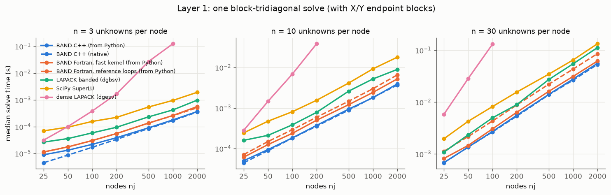
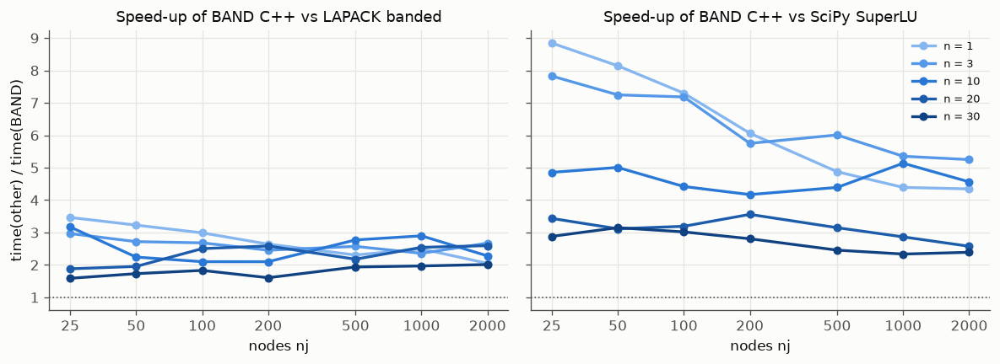
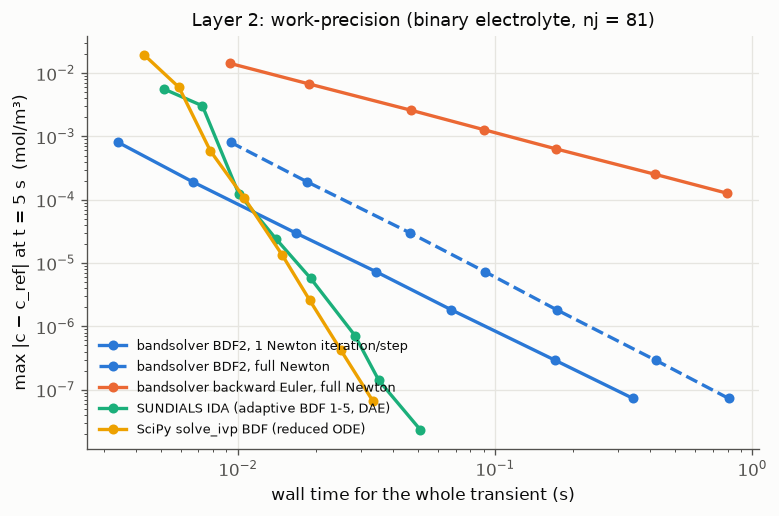
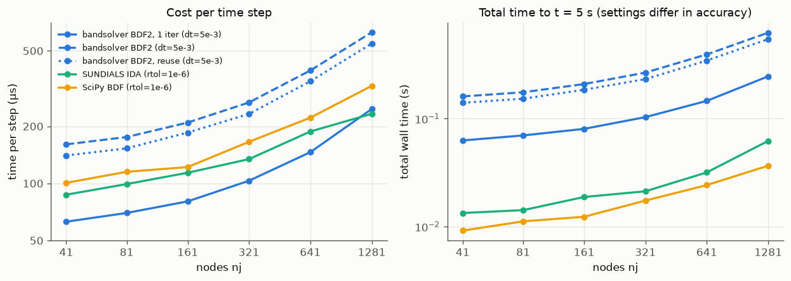

# Benchmarks: BAND vs other solvers (layers 1–2)

**Date:** 2026-09-27.

**Machine:** Apple M1 Pro (macOS 14.6, arm64), one core.

**Software:** Python 3.13.3, numpy 2.5.3, SciPy 1.18.1, scikit-sundae 1.1.3 (SUNDIALS), gfortran 14.2.0, Apple clang 16. The full record is in [`benchmarks/results/env.json`](../benchmarks/results/env.json).

**Rerun:** see [Reproducing](#reproducing). Raw results are in [`benchmarks/results/`](../benchmarks/results).

The comparison is **layered** so that different effects aren't conflated:

- **Layer 1** times a single linear block solve: pure linear algebra.
- **Layer 2** times a complete nonlinear transient simulation: time integration, Newton iterations and residual evaluations as well.
- **Layer 3**, application frameworks such as PyBaMM, is deferred.

All timings come from one machine and are indicative; the ratios are more portable than the absolute numbers.

## Summary

- **Linear solves (layer 1).**
  - BAND is the fastest method tested at every size: n = 1–30 unknowns per node, nj = 25–2000 nodes.
  - It is **1.6–5.8× faster than LAPACK's banded solver** (median 2.4×) and **2.4–12× faster than SciPy's SuperLU** (median 4.8×).
  - It needs up to **9× less memory** than banded LAPACK.
  - Calling it from Python adds about 5 µs per call, which is negligible beyond about 200 nodes.
- **Transient simulation (layer 2).**
  - **Per step:** with one linearized Newton correction per step (how the archival battery codes use BAND), bandsolver has the **cheapest time step** up to about 1,000 nodes, and ties with IDA at 1,281.
  - **Loose to moderate accuracy** (errors above about 1e-4 mol/m³, i.e. 1e-6 relative), it is also the **fastest overall**.
  - **Tighter accuracy:** SUNDIALS IDA and SciPy's BDF win, because variable step size and order (up to 5) need far fewer steps than fixed-step BDF2.
  - The gap is in **time-integration strategy**, not linear algebra.

## Layer 1: one linear block solve

**Problem.** Random, well-conditioned block systems in the Appendix C form: block tridiagonal plus the X/Y endpoint blocks. Every method solves exactly the same matrix.

**Methods:**

| Method | What is timed |
|---|---|
| BAND C++ / Fortran, from Python | `bs.solve(...)`, including input checks and conversion |
| BAND C++ / Fortran, native | the same solve from a C++ harness, with no Python |
| LAPACK banded (`scipy.linalg.solve_banded`, dgbsv) | band factor + solve. X/Y widen the band to 3n−1 on each side |
| SciPy SuperLU (`splu`) | sparse factor + solve (natural and COLAMD orderings) |
| dense LAPACK (`numpy.linalg.solve`) | only when N = n·nj ≤ 3000 |

Converting the blocks into each library's input format is **excluded** from the timings and recorded separately. Each point is the median of at least 5 repeats and at least 0.2 s. Every solution's backward error was checked: the worst was 8.7e-16.




**Selected results** (median time per solve, in ms):

| n | nj | BAND C++ (Python) | BAND C++ native | BAND Fortran (Python) | LAPACK banded | SuperLU | dense |
|---|---|---|---|---|---|---|---|
| 1 | 100 | 0.008 | 0.004 | 0.013 | 0.024 | 0.060 | 0.047 |
| 3 | 200 | 0.039 | 0.034 | 0.055 | 0.105 | 0.228 | 1.97 |
| 5 | 500 | 0.273 | 0.258 | 0.385 | 0.506 | 1.24 | 103 |
| 10 | 1000 | 1.93 | 1.78 | 3.06 | 4.97 | 9.60 | – |
| 30 | 2000 | 54.6 | 56.4 | 87.0 | 110 | 131 | – |

**Observations:**

- **Why BAND wins.** It eliminates node by node with dense n×n blocks, so it never stores or factors the zero fill inside the band. The X/Y blocks only affect the first and last nodes. Banded LAPACK has to treat the whole matrix as having bandwidth 3n−1 because of X/Y, and it also stores pivoting fill. SuperLU pays for general sparse bookkeeping.
- **Memory.** Factor storage at n = 30, nj = 2000 is 14.9 MB for BAND, 128.6 MB for LAPACK banded, and 65.5 MB for SuperLU.
- **Scaling.** Cost is linear in nj (×2.05 per doubling). It grows more slowly than n³ with the block size, ×13.8 from n = 10 to 30, because small blocks are less efficient per flop.
- **Python overhead.** About 5 µs per call, i.e. ×4.9 on the smallest system (n = 1, nj = 25) but ≤ ×1.2 from nj ≈ 200. The native and Python timings of large systems are within run-to-run noise.
- **Fortran vs C++.** The Fortran core was originally 1.5–2.2× slower than the C++ core even natively. Its loops kept the archival row-wise order, which runs against Fortran's column-major memory layout. Since 0.1.2 the default **fast kernel** is used; see the next section.

### Fortran kernel option: fast vs reference loops

The option is `kernel="fast"` (default) or `kernel="reference"` (Fortran backend; `KERNEL_FAST` / `KERNEL_REFERENCE` in Fortran and C).
- **What the fast kernel changes:** it runs the partial-pivot block updates, the Gauss–Jordan elimination and the back substitution column by column, which is contiguous in Fortran.
- **Accuracy:** each matrix entry still accumulates in the same order, so the two kernels give **bit-identical results**, checked by tests.
- **Small blocks:** for blocks smaller than 4×4, the column loops are too short to pay off, so the fast kernel uses the reference loop order there.
- **Legacy mode:** the legacy pivot mode always uses the reference loops.

| n | reference / fast (Fortran core, native) | Fortran fast / C++, via C ABI | Fortran fast / C++, core called from Fortran |
|---|---|---|---|
| 1 | 1.00 | 2.2 | 2.2 |
| 3 | 1.00 | 1.5 | 1.3 |
| 5 | 1.10 | 1.06 | 0.96 |
| 10 | 1.17–1.22 | 1.34 | 1.14 |
| 20 | 0.99–1.02 | 1.26–1.34 | 1.08 |
| 30 | 1.36–1.38 | 1.12–1.22 | 0.98 |

The first two columns come from `results/linear.csv` (nj = 100 and 2000); the last is a direct Fortran timing at nj = 2000.
- **Where Fortran now stands:** for n ≥ 5, the Fortran core is at parity with C++ when called from Fortran. Through the C ABI it's within 1.06–1.34×; the extra cost comes from the ABI's block transposes.
- **Remaining gap:** for n ≤ 3, a fixed per-node overhead keeps Fortran 1.3–2.2× slower than C++. This is recorded as a follow-up; a specialised scalar/2×2 path is the likely fix.

## Layer 2: a nonlinear transient simulation

**Problem.** Galvanostatic transport in a binary electrolyte, from [notebook 2](../notebooks/02_binary_electrolyte.ipynb): coupled Nernst–Planck equations for concentration c and potential φ, where φ is algebraic, making this a DAE. It uses a finite-volume mesh with nj = 81 nodes and runs to t = 5 s (the diffusion time L²/D is 7.5 s). All stacks solve **the same discretization**. The reference is IDA at rtol = 1e-12, so the errors below are *time-integration* errors.

**Solver stacks:**

| Stack | Time integration | Nonlinear/linear solve |
|---|---|---|
| bandsolver BE / BDF2, full Newton | fixed Δt, user code | Newton to rtol 1e-10 each step; analytic Jacobian blocks; BAND |
| bandsolver BDF2, 1 Newton iteration/step | fixed Δt, user code | one linearized correction per step (the archival usage); BAND |
| SUNDIALS IDA | adaptive step size and order (BDF 1–5) on the DAE | modified Newton with Jacobian reuse; band LU; IDA's internal finite-difference Jacobian |
| SciPy `solve_ivp(BDF)` | adaptive step size and order (BDF 1–5) | SciPy has **no DAE support**, so φ was eliminated exactly at each face (current conservation), leaving an ODE in c with a tridiagonal Jacobian |

**Consistency.** Against the reference, IDA at rtol 1e-10 differs by 2.3e-8 mol/m³, SciPy at 1e-10 by 6.7e-8, and bandsolver BDF2 at Δt = 1e-4 by 1.3e-9. All stacks therefore converge to the same discrete solution.



**Work-precision** (error in mol/m³, with c ≈ 75–126 mol/m³, and time for the whole transient):

| Target error | fastest bandsolver setting | IDA | SciPy BDF |
|---|---|---|---|
| ~1e-3 | BDF2, 1 iter, Δt = 0.1: **8.1e-4 in 3.4 ms** | 3.0e-3 in 7.3 ms | 6.0e-4 in 7.8 ms |
| ~1e-4 | BDF2, 1 iter, Δt = 0.05: **1.9e-4 in 6.6 ms** | 1.2e-4 in 10.0 ms | 1.1e-4 in 10.6 ms |
| ~1e-5 | BDF2, 1 iter, Δt = 0.01: 7.4e-6 in 34 ms | **5.7e-6 in 19 ms** | 1.3e-5 in 15 ms |
| ~1e-7 | BDF2, 1 iter, Δt = 0.001: 7.3e-8 in 343 ms | 1.4e-7 in 35 ms | **6.7e-8 in 33 ms** |



**Cost per time step** (µs, from mesh scaling at fixed settings):

| nj | BDF2, 1 iter | BDF2, full Newton | IDA (rtol 1e-6) | SciPy (rtol 1e-6) |
|---|---|---|---|---|
| 41 | **64** | 160 | 90 | 105 |
| 321 | **100** | 272 | 134 | 156 |
| 1281 | 242 | 662 | **238** | 326 |

The total-time panel compares runs at *different* accuracies, so use the per-step panel to compare cost.

### Where the time goes

- **Per Newton iteration** at nj = 81, bandsolver spends about 51 µs in the Python fill (residual plus Jacobian blocks) and about 10 µs in the BAND solve. Python dominates.
- **Full Newton** runs 2.6–2.8 iterations per step because its default tolerance (rtol 1e-10) is far tighter than the step's truncation error. IDA sets its Newton tolerance from rtol and reuses its Jacobian: 1.3 residual evaluations per step, and 22 Jacobians in 143 steps.
- **One linearized correction per step** gives the *same accuracy* as full Newton on this mildly nonlinear problem, at 2.7× lower cost. This is not guaranteed for strongly nonlinear kinetics: check it by comparing against a converged-Newton run, as done here.
- **Fixed step size and second order** are what lose at tight tolerances. For the same error, adaptive order-5 BDF needs about 2–3.5× fewer steps at ~1e-5, and 10–14× fewer at ~1e-7.

## Conclusions

1. As a **linear kernel**, BAND is the best of the options tested for 1-D block-banded systems: faster, and much leaner in memory.
2. For **transient simulations**, BAND with simple fixed-step BDF2 is competitive, and fastest at engineering accuracy. Its cheap steps make it attractive for long, moderately accurate runs, such as battery cycling. For tight tolerances, use adaptive high-order integration.
3. **Where to take it next:** combine the two.
   - Add adaptive step-size control and Jacobian reuse to the bandsolver driver;
   - use BAND as the linear solver inside SUNDIALS IDA (a custom `SUNLinearSolver`);
   - write residuals natively (C++/Fortran) to remove the Python fill cost that dominates small problems.

## Fairness notes and limitations

- **Hardware.** There is one machine and one core. Timings are indicative, and the ratios are more portable than absolute times.
- **Python callbacks.** All layer 2 stacks evaluate their residuals through numpy-vectorized Python callbacks, so they share the same interpreter overhead. The layer 1 native timings isolate BAND's own cost.
- **Jacobians.** IDA used its internal finite-difference band Jacobian, while bandsolver used analytic blocks. Giving IDA an analytic Jacobian would reduce its Jacobian cost, which is already amortized by reuse.
- **SciPy's model.** SciPy solved an equivalent reduced ODE because it cannot integrate DAEs. The elimination was exact here, but in general it has to be done by hand.
- **Error measure.** The error is the max-norm in c at the final time only. IDA's and SciPy's error control is local, so their tolerance is not their global error; the plots use the measured global error.
- **Not yet benchmarked.** Other problem classes (strongly nonlinear kinetics, stiff reaction terms), iterative solvers, KLU and PETSc.

## Reproducing

```sh
pip install .                                  # bandsolver
pip install -r benchmarks/requirements.txt     # pinned: numpy, scipy, scikit-sundae, matplotlib
cmake -S . -B build-bench -DCMAKE_BUILD_TYPE=Release -DBANDSOLVER_BUILD_BENCHMARKS=ON
cmake --build build-bench --target native_bench
python benchmarks/linear.py --native build-bench/benchmarks/native_bench   # ~1.5 min
python benchmarks/transient.py                                             # ~30 s
python benchmarks/plot.py linear transient
```

Each script accepts `--quick` for a smoke test at tiny sizes, which CI runs on Linux and macOS. scikit-sundae 1.1.3 publishes wheels only for Linux x86_64, macOS and Windows. On other platforms (such as Linux aarch64) it needs a local SUNDIALS build; there, the quick smoke run skips the IDA cases and the full run stops with a clear message. The summary notebook [05 · Benchmarks](../notebooks/05_benchmarks.ipynb) reads the saved CSVs and does not re-run anything.
